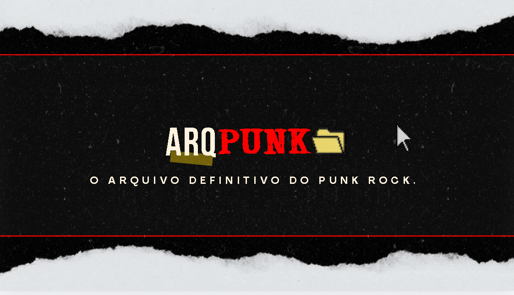

---

# ArqPunk
 
> O arquivo definitivo do Punk Rock. História, subculturas e Música num só lugar.
 

 
---
 
## Sobre o projeto
 
O **ArqPunk** nasceu da necessidade de ter um lugar exclusivo e aberto para documentar e celebrar o punk em todas as suas formas. Aqui você encontra a história do movimento, suas principais subculturas e um recomendador de músicas baseado no seu gosto.
 
Sem algoritmo corporativo. D.I.Y.
 
---
 
## Funcionalidades
 
- **História** - Cronologia do punk do UK76 ao Brasil, com contexto político e cultural.
- **Subculturas** - Hardcore, Oi!, Riot Grrrl, Crust, Street Punk e muito mais.
- **Punk Brasileiro** - Garotos Podres, Inocentes, Ratos de Porão e a cena que merece mais atenção.
- **Recomendador Musical** - Sugere bandas e álbuns com base no que você já curte.
- **Estética & Arte** - A estética visual do movimento e artes da autora do site.
---
 
## </> | Linguagens e Tecnologias (Stack)
 
| Camada | Tecnologia | Descrição |
|--------|------------|----------|
| Frontend |    | HTML para o corpo do site, CSS para o design e Javascript para as funcionalidades|
| Backend |  +  | Servidor que processará as requisições do site, como conexão com o Banco e criação de Gráficos |
| Banco de dados |   | Armazenamento e manuseio de dados |

---
 
## 📁 Estrutura do projeto
 
arqpunk/
│
├── public/                         Tudo que o navegador acessa
│   │
│   ├── css/
│   │   ├── style.css               Estilo da home e páginas gerais
│   │   ├── styleautent.css         Estilo da tela de login/cadastro
│   │   ├── stylehistoria.css       Estilo de história e vertentes
│   │   ├── stlyledash.css          Estilo da dashboard do usuário
│   │   └── styleadmin.css          Estilo do painel admin
│   │
│   ├── js/
│   │   ├── index.js                Verificação de login + controle do header
│   │   ├── autenticacao.js         Login e cadastro (fetch → API)
│   │   ├── dashboard.js            Dados do usuário
│   │   └── admin.js                Painel admin
│   │
│   ├── imgs/                       Imagens, logos, gifs
│   │
│   ├── dashboard/
│   │   ├── dashboard.html          Página de perfil do usuário logado
│   │   └── admin.html              Painel para admin
│   │
│   ├── index.html                  Home - pública
│   ├── autenticacao.html           Login e cadastro - pública
│   ├── historia.html               Protegida - logado
│   ├── vertentes.html              Protegida - logado
│   ├── musica.html                 Protegida - logado
│   └── sobre.html                  Protegida - logado
│
├── src/                            API - Web-Data-Viz
│   │
│   ├── routes/
│   │   ├── index.js                Rota raiz
│   │   └── usuarios.js             Rotas /usuarios/cadastrar e /autenticar
│   │
│   ├── controllers/
│   │   └── usuarioController.js    Valida os dados e chama o model
│   │
│   ├── models/
│   │   └── usuarioModel.js         Faz as queries no banco MySQL
│   │
│   └── database/
│       ├── config.js               Conexão com o banco
│       └── script-tabelas.sql      SQL ArqPunk
│
│
├── app.js                          Inicia o servidor Express
├── .env                            Credenciais de produção
├── .env.dev                        Credenciais de desenvolvimento
├── package.json                    ---
└── .gitignore                      ---
 
---

-----